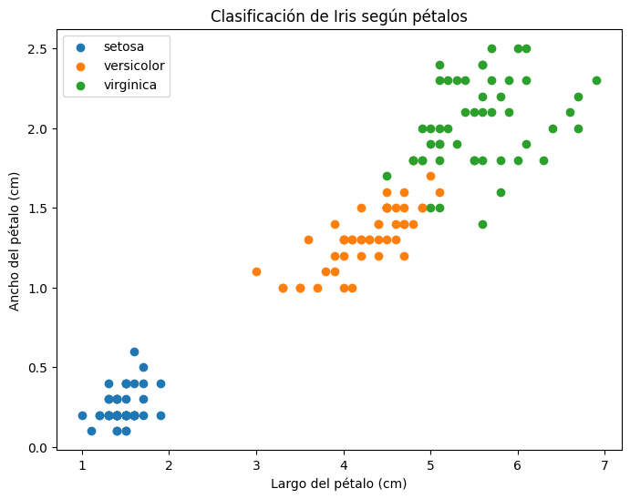
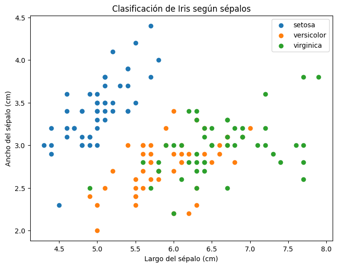
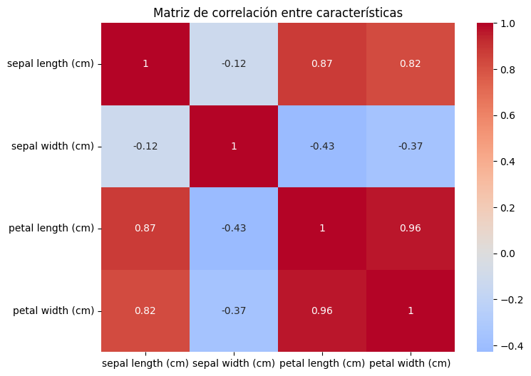
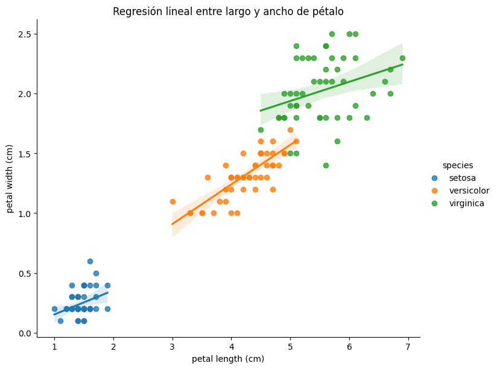
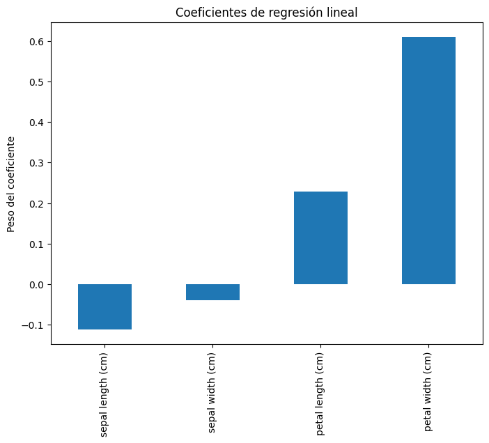

# Regresión Lineal - Dataset Iris

## 👥 Autores
- Christian Barreto  
- Juan Barbosa Avella  

---

## Descripción del Proyecto
Proyecto de **clasificación** utilizando **dataset Iris**. 

El objetivo fue aplicar un modelo de **Regresión Lineal** para diferenciar entre las tres especies de flores:  
- *Iris setosa*  
- *Iris versicolor*  
- *Iris virginica*  

La clasificación se realizó a partir de sus **características morfológicas** (sépalos y pétalos), con un enfoque exploratorio y de interpretación de resultados.

---

## 📊 Dataset Iris
El dataset contiene un total de **150 observaciones**, distribuidas en **3 clases** con 50 muestras cada una:

- **Iris setosa** (50)  
- **Iris versicolor** (50)  
- **Iris virginica** (50)  

Cada muestra está descrita por **4 variables numéricas (features)** medidas en centímetros:

1. `Sepal length (cm)` → Largo del sépalo  
2. `Sepal width (cm)` → Ancho del sépalo  
3. `Petal length (cm)` → Largo del pétalo  
4. `Petal width (cm)` → Ancho del pétalo  

Estas características son las **variables predictoras** que permiten diferenciar entre especies.

[Descargar iris.csv](data/iris.csv)

---

## Librerías utilizadas
El desarrollo se apoyó en las siguientes librerías de **Python**:

- **pandas** → Manipulación de datos, creación de DataFrames y exportación a CSV.  
- **matplotlib** → Visualización de gráficos básicos como dispersión, barras y comparación de resultados.  
- **seaborn** → Visualizaciones avanzadas: regresiones lineales, mapas de calor y gráficos con estilos mejorados.  
- **scikit-learn (sklearn)** → Carga del dataset Iris, entrenamiento del modelo de regresión lineal y evaluación de resultados.  

---

## Diseño del procedimiento
El diseño del trabajo siguió los siguientes pasos:

1. **Carga del dataset Iris** usando `sklearn.datasets`.  
2. **Conversión a DataFrame** para manipular características y etiquetas.  
3. **Análisis exploratorio de datos (EDA)** con gráficos de dispersión y correlación.  
4. **Selección del modelo:** se utilizó **Regresión Lineal** para aproximar la separación de clases.  
5. **Visualización de resultados** mediante múltiples gráficos interpretativos.  
6. **Evaluación del modelo** analizando los coeficientes y comparando predicciones con valores reales.  

---

## 📈 Gráficos y Análisis

### Dispersión de pétalo
Relación entre **largo** y **ancho del pétalo** diferenciando especies por colores.  
- *Setosa* se separa claramente de las demás.  
- *Versicolor* y *Virginica* presentan cierta superposición, pero siguen siendo distinguibles.  
  Los pétalos son las variables más útiles para la clasificación.  

---

### Dispersión de sépalo
Relación entre **largo** y **ancho del sépalo**.  
- *Setosa* se diferencia parcialmente.  
- *Versicolor* y *Virginica* se mezclan mucho.  
  Las medidas de sépalo aportan menor relevancia al modelo.

---

### Mapa de calor de correlación
Muestra la correlación entre todas las características.  
- Fuerte correlación entre **largo y ancho de pétalo (0.96)**.  
- Correlación entre **largo de pétalo y largo de sépalo**.  
- Ancho del sépalo tiene poca relación con las demás.  
  Identifica qué variables son más influyentes.

---

### Regresión lineal entre largo y ancho de pétalo
Relación lineal entre **largo** y **ancho del pétalo**, con líneas de regresión diferenciadas por especie.  
- Se observa una relación **casi lineal** en los pétalos.  
- Cada especie tiene un comportamiento distinto en la pendiente.

---

### Coeficientes del modelo de regresión lineal
Importancia (peso) que el modelo asigna a cada variable.  
- Mayor peso: **ancho del pétalo**.  
- Segundo lugar: **largo del pétalo**.  
- Sépalos tienen coeficientes muy bajos.  
  El modelo confirma que los pétalos son las características más discriminantes.  

---

## Conclusión
El **dataset Iris**, con sus cuatro características principales, permitió analizar cómo la **regresión lineal** puede aproximar un problema de clasificación. Los resultados evidencian que las variables relacionadas con los **pétalos** son las más relevantes para distinguir entre especies, mientras que las características de los **sépalos** son menos útiles debido a su solapamiento.  

---
